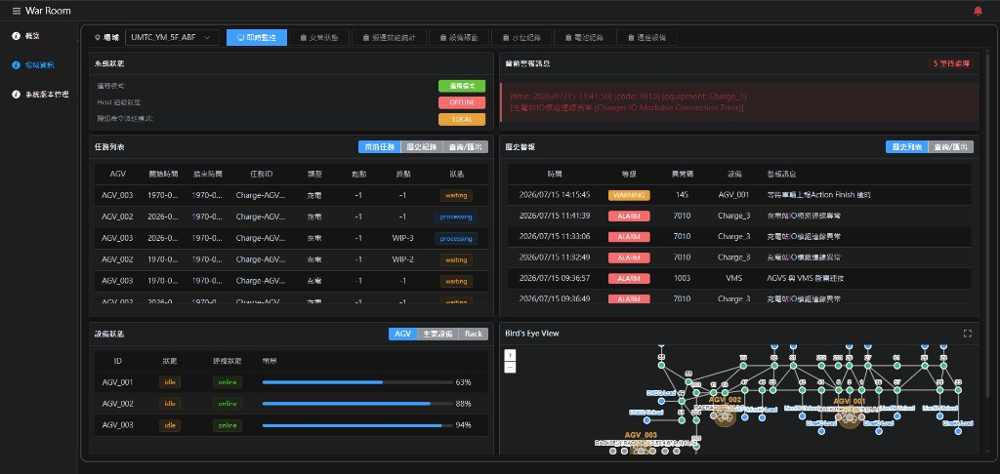
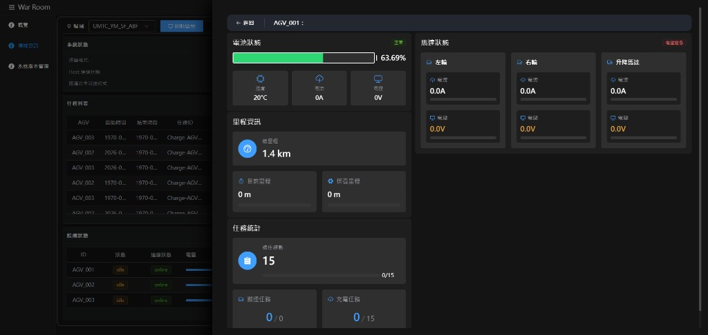
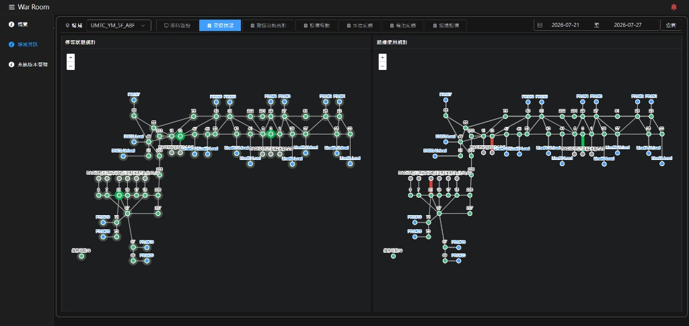
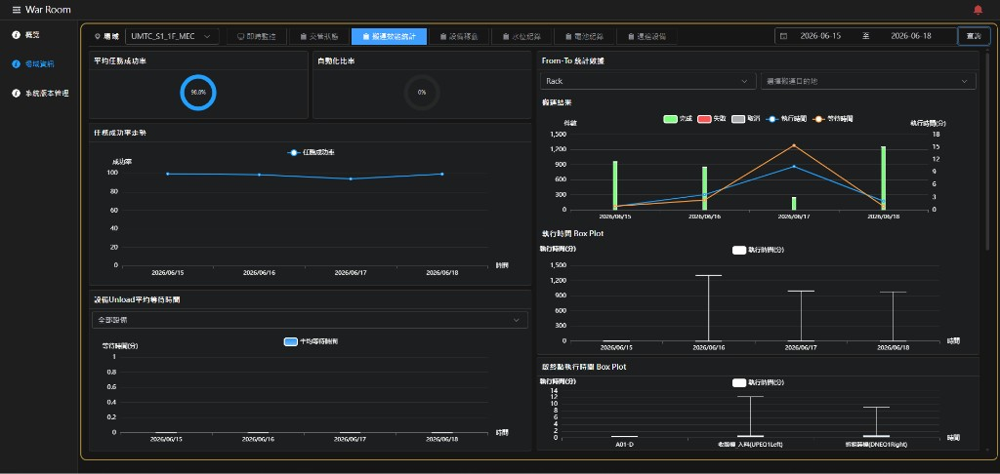
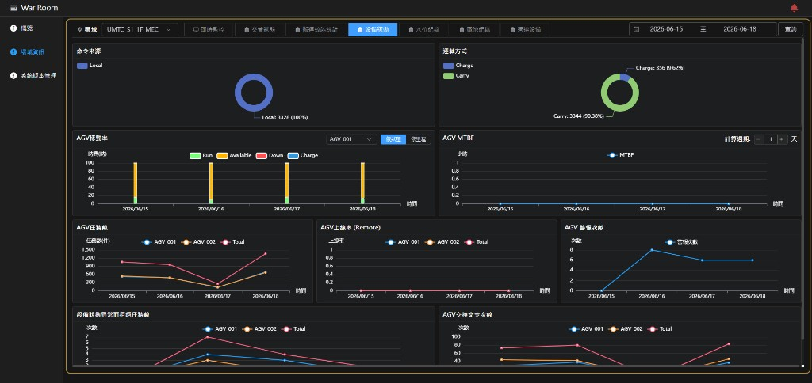
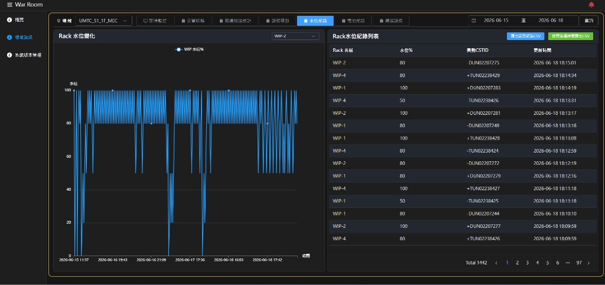
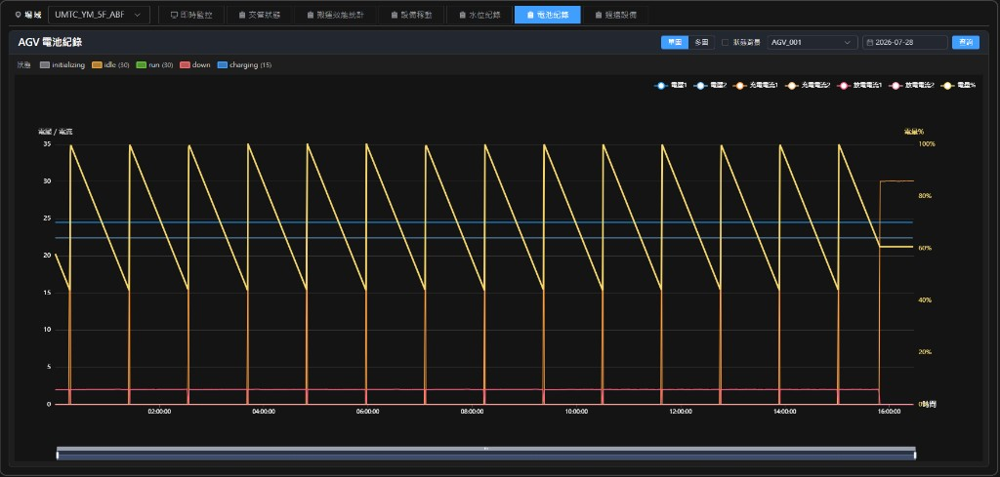
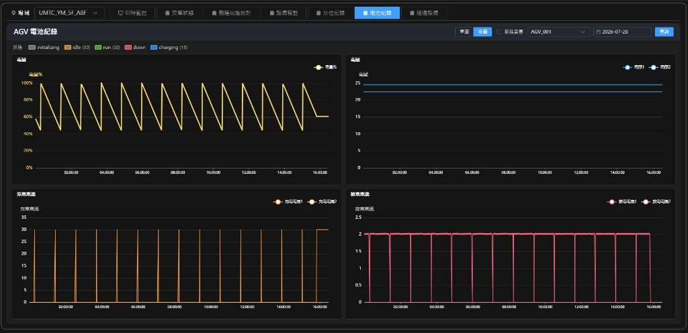
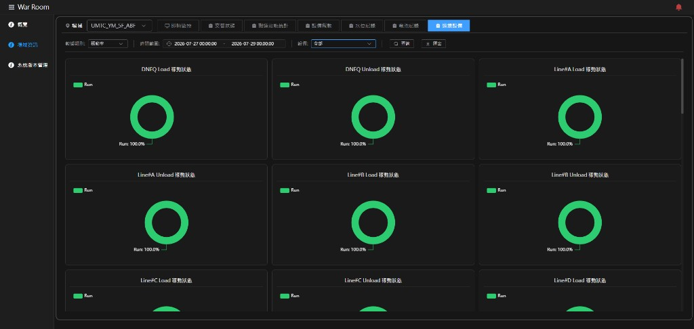

# War Room 前端操作說明

本文件依目前前端畫面與實際操作流程整理，並以系統真實截圖作為範例圖片。

完整圖文版與 PDF 請見同目錄：
- `frontend-operation-manual.html`
- `frontend-operation-manual.pdf`

## 目錄

1. 系統導覽
2. 即時監控
3. 設備狀態詳情（AGV）
4. 交管狀態
5. 搬運效能統計
6. 設備稼動
7. 水位紀錄
8. 電池紀錄
9. 週邊設備
10. 建議操作流程

## 1. 系統導覽

- 左側選單：`概覽`、`場域資訊`、`系統版本管理`
- 左上選單圖示可展開 / 收合側邊欄
- 右上鈴鐺可控制告警聲音（正常 / 永久靜音）
- 場域資訊頁可用「場域」下拉切換目標場域

## 2. 即時監控

1. 進入「場域資訊」並選擇場域
2. 點選「即時監控」
3. 檢查系統狀態、任務列表、設備狀態、當前警報、歷史警報與鳥瞰圖
4. 點選 AGV / Rack 開啟設備詳情

## 3. 設備狀態詳情（AGV）

- 電池狀態：電量、溫度、電流、電壓
- 里程資訊：總里程、目前里程、保養里程
- 任務統計：搬運 / 充電任務
- 馬達狀態：左輪、右輪、升降馬達

## 4. 交管狀態

1. 切換至「交管狀態」
2. 設定日期區間後點擊「查詢」
3. 左圖看停等熱點，右圖看路線使用量

## 5. 搬運效能統計

1. 切換至「搬運效能統計」
2. 設定日期區間並查詢
3. 調整 Unload 設備與 From-To 條件
4. 需要時載入歷史任務並勾選路線

## 6. 設備稼動

1. 切換至「設備稼動」
2. 設定日期區間並查詢
3. 切換稼動率顯示方式與 MTBF 計算週期
4. 對照警報次數與拒絕任務數

## 7. 水位紀錄

1. 切換至「水位紀錄」
2. 設定日期區間並查詢
3. 於左側切換 WIP / Rack
4. 於右側列表查看異動，必要時匯出 CSV

## 8. 電池紀錄

1. 切換至「電池紀錄」
2. 選擇 AGV 與日期後查詢
3. 切換「單圖 / 多圖」
4. 勾選「狀態背景」對照狀態與電量變化

## 9. 週邊設備

1. 切換至「週邊設備」
2. 選擇數據類別（稼動率 / 警報）與時間範圍
3. 點擊「查詢」；需要時「匯出」

## 10. 建議操作流程

1. 從概覽發現異常場域
2. 進入場域資訊 > 即時監控
3. 開啟設備詳情確認細節
4. 再切到交管 / 效能 / 稼動 / 水位 / 電池做歷史分析
5. 必要時到週邊設備查詢與匯出
